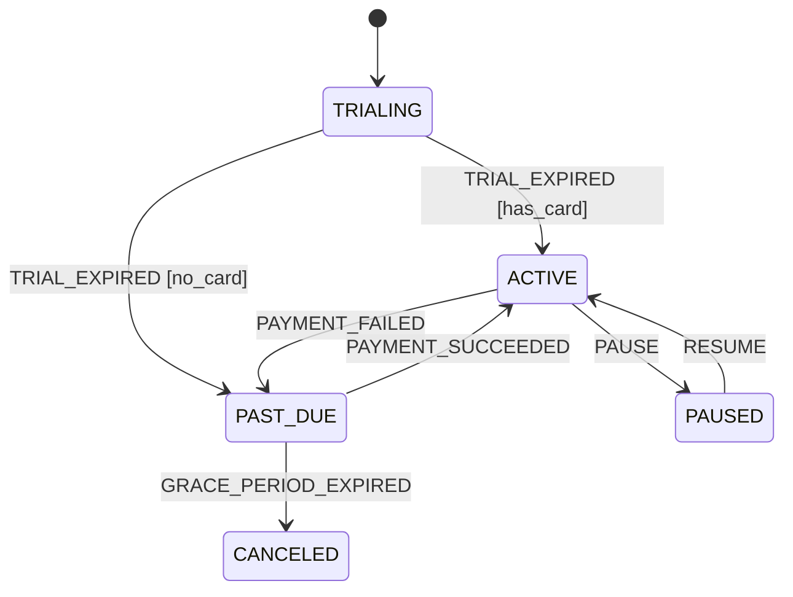

# Example: State Machine Designer

## Input

> "Design a state machine for an e-commerce subscription lifecycle with trial, active, past_due, canceled, and paused states."

## Output

### State Transition Table
| Current State | Event | Guard | Next State | Action |
|---|---|---|---|---|
| `TRIALING` | `TRIAL_EXPIRED` | Has valid card | `ACTIVE` | Charge payment |
| `TRIALING` | `TRIAL_EXPIRED` | No valid card | `PAST_DUE` | Send payment warning email |
| `ACTIVE` | `PAYMENT_FAILED` | - | `PAST_DUE` | Start 7-day grace period |
| `PAST_DUE` | `PAYMENT_SUCCEEDED` | - | `ACTIVE` | Restore access |
| `PAST_DUE` | `GRACE_PERIOD_EXPIRED` | - | `CANCELED` | Revoke access |
| `ACTIVE` | `PAUSE` | - | `PAUSED` | Set resume date |
| `PAUSED` | `RESUME` | - | `ACTIVE` | Re-enable billing |

### Mermaid State Diagram

